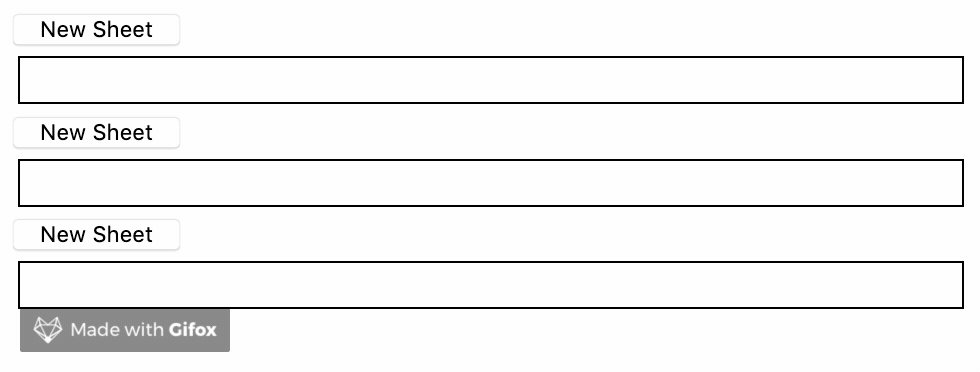

# Automerge-CodeMirror

[](https://travis-ci.org/aslakhellesoy/automerge-codemirror)

Automerge-CodeMirror brings collaborative editing to CodeMirror by linking it to
an `Automerge.Text` object.

You can have as many `Automerge.Text` objects as you want inside a single Automerge document, and link each of them to
a separate CodeMirror instance. This is useful for applications that render many editable text areas (such as a
Trello-like application with multiple cards).

It ships with a React component, but can also be used without React.

Automerge-CodeMirror can be used with both JavaScript and TypeScript.

## Installation

    npm install automerge-codemirror

## Demo

    yarn storybook



What you see above is 3 Automerge documents synchronised without a network, but it works equally
well over a network.

## General Usage

The Automerge <-> CodeMirror synchronisation happens in the `updateAutomergeDoc` and `updateCodeMirrorDocs` functions.
In order to prevent an infinite loop when changes are made, a `Mutex` object must be passed to the `updateCodeMirrorDocs` function.

See unit tests for examples.

## React Usage

The `AutomergeCodeMirror` React component encapsulates `updateAutomergeDoc`, so you don't have to use it directly.
It is a _pure_ component, so it won't rerender (flicker) when the Automerge document changes. It instantiates a new
native CodeMirror component when it mounts, and registers a change handler that will call `updateAutomergeDoc` when
the user types.
This handler is automatically unregistered when the component unmounts.

You also have two React hooks at your disposal `useAutomergeDoc` and `useCodeMirrorUpdater`, which handle external updates
to the Automerge document.

To illustrate how all of this works, let's define a React component that puts them all to use. The `PadComponent` renders
a CodeMirror editor for every `Text` object in a `Pad` Automerge document:

```tsx
import { change, Text, WatchableDoc } from 'automerge'
import React, { FunctionComponent } from 'react'
import {
  AutomergeCodeMirror,
  Link,
  Mutex,
  useAutomergeDoc,
  useCodeMirrorUpdater,
} from 'automerge-codemirror'

interface Pad {
  sheets: Text[]
}

interface Props {
  watchableDoc: WatchableDoc<Pad>
  mutex: Mutex
  links: Set<Link<Pad>>
}

const PadComponent: FunctionComponent<Props> = ({
  watchableDoc,
  mutex,
  links,
}) => {
  // This hook will cause a rerender whenever the Automerge document changes, so we can render new sheets
  const doc = useAutomergeDoc(watchableDoc)

  // This hook updates all the CodeMirror editors when the Automerge document changes
  useCodeMirrorUpdater(watchableDoc, mutex, links)

  return (
    <div>
      {doc.sheets.map((pad, i) => (
        <div key={i}>
          <AutomergeCodeMirror
            watchableDoc={watchableDoc}
            getText={doc => doc.sheets[i]}
            links={links}
            mutex={mutex}
          />
        </div>
      ))}
    </div>
  )
}

export { PadComponent, Pad }
```

Now we can use it:

```tsx
<PadComponent
  watchableDoc={watchableDoc}
  mutex={new Mutex()}
  links={new Set<Link<Pad>>()}
/>
```

## Synchronisation with other peers

Automerge-CodeMirror is agnostic of how you choose to synchronize the linked Automerge document
with other peers.

You can use `Automerge.DocSet` / `Automerge.Connection` (as the example below),
but you can also use any other mechanism supported by
[Automerge](https://github.com/automerge/automerge).
